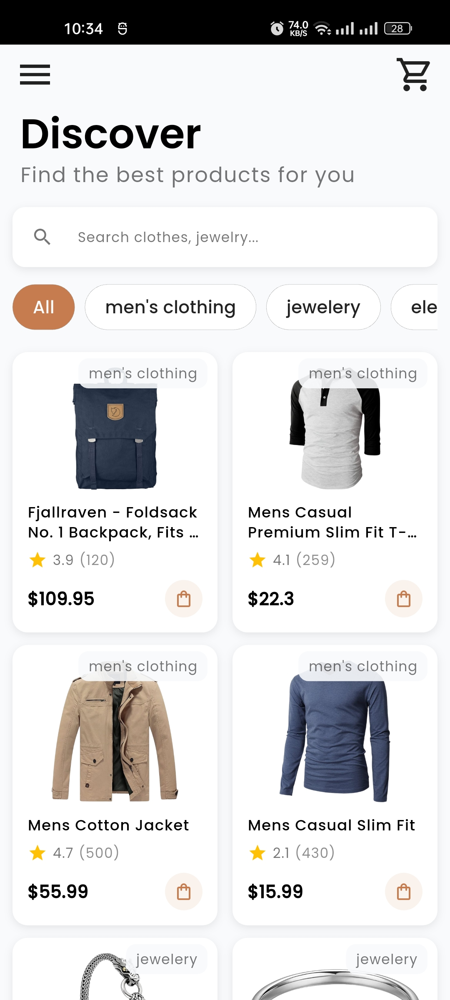
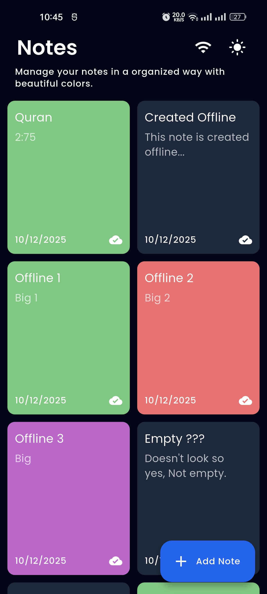
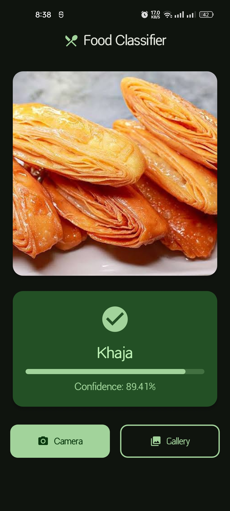

# SAA Recruitment Task


## Overview
This repository contains 4 Flutter app development tasks that were given to me to assess my flutter skill by ScaleUp Ads Agency.

## Repository Structure
```
├── Task1/
├── Task2/
├── Task3/
├── Task4/
├── screenshots/
└── README.md
```

## Implemented
- **I succesfully completed all the tasks with bonus features maintaing clean and modern UI**

## Things I Avoided
- I didn't implement any performance feature as this was not a evaluation criteria
- I didn't use cached image
- There wasn't any need for paraller processing
- Didn't add any launcher icon nor splash screen

---

## Task 1: Login Screen with Validation

### Description
I had to design a Login Screen with Validation and clean UI


### Key Considerations
- I used ScaleUp Ads Agency's logo and used the colors from that logo
- Email TextFormField notifies if the provided email is valid or not with a suffix icon.

### Screenshots


---

## Task 2: Product List with Search and Filter

### Description
Product List with Search and Filter


### Key Considerations
- Completed with bonus features
- Added a product details page with clean UI

### Screenshots



---

## Task 3: Note-Taking App with Offline Sync

### Description
Create a Note-Taking App with Offline Sync 

### Key Considerations
- Completed with bonus features
- Used Drift for local database
- Didn't fully used Data, Domain, Presentation layer as I used Bloc
- Bloc handled all necessary clean architecture, so tried to avoid any overhead
- Created entities in Domain layer but didn't use it. Used drift's generated model

### Screenshots


### Technologies Used
- Drift
- BLoC

---

## Task 4: Food Classification Using Camera and TFLite

### Description
Food Classification Using Camera and TFLite

### Key Considerations
- Perfectly integrated the model and it works great
- Tried to keep the app as simple as possible

### Screenshots


### Technologies Used
- TFlite
- Camera
- Image picker

---


## Author
**Md. Maksaline Haque Sajib**
- GitHub: [@Maksaline](https://github.com/Maksaline)
- Portfolio: [Maksaline.com](https://maksaline.com/)
- Email: sajib19285@gmail.com
